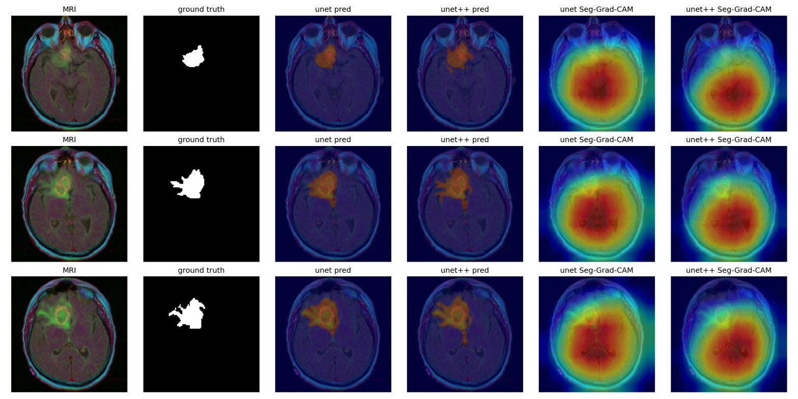
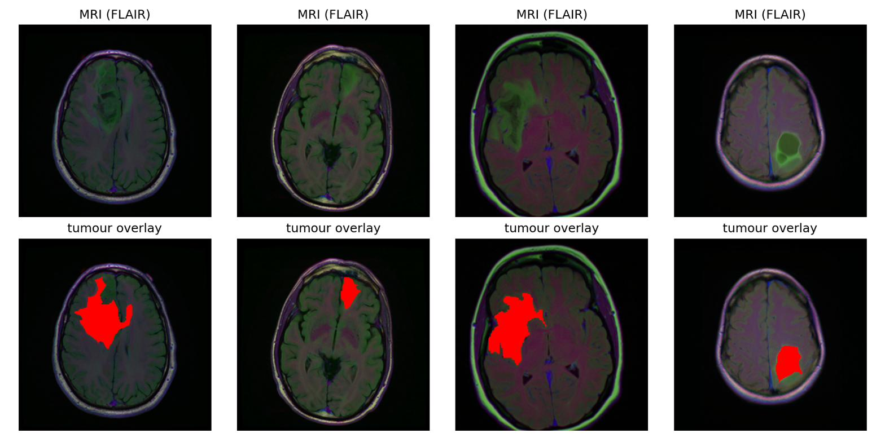
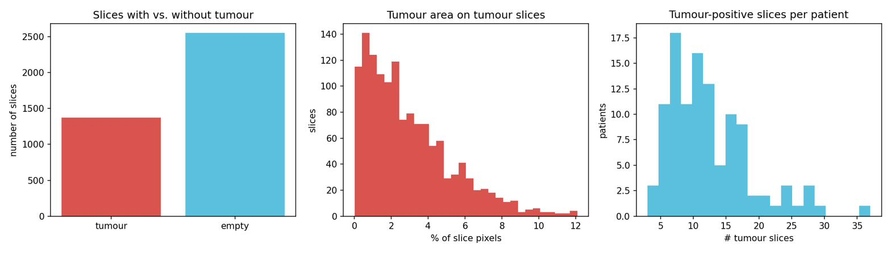
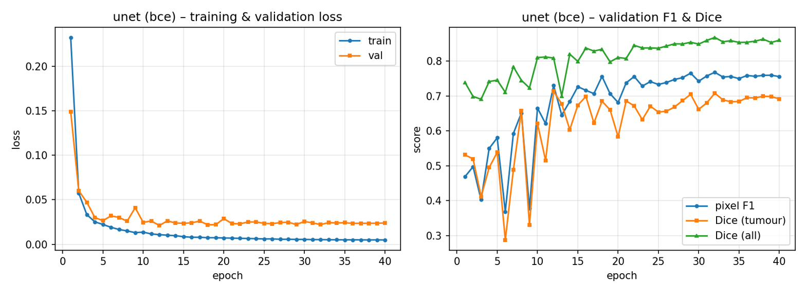
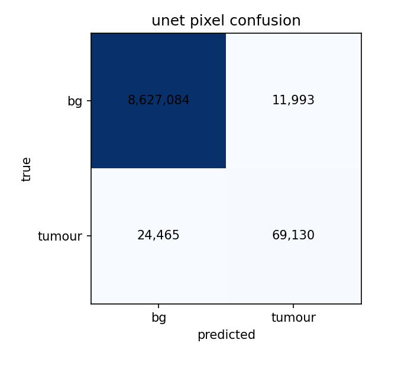
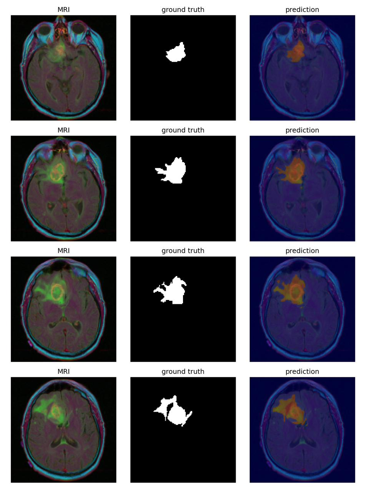

# Brain Tumour Segmentation — U-Net vs U-Net++ on the LGG MRI Dataset

Binary segmentation of the FLAIR abnormality (lower-grade glioma) in brain MRI, comparing **U-Net** and **U-Net++** implemented from scratch in PyTorch. The project runs a controlled set of ablations over the **loss function**, **data augmentation**, and **tumour-slice oversampling**, with morphological post-processing and **Seg-Grad-CAM** explainability.

> **Key finding:** the choice of *loss function* influenced tumour segmentation far more than the choice of *architecture*. Plain BCE reached a tumour-slice Dice of **0.655** (U-Net) / **0.625** (U-Net++), well above the Dice+BCE hybrid (0.404 / 0.482), while the two architectures were statistically indistinguishable at their best setting.

*Computer Vision & Deep Learning — University of Verona, 2025–26.*



---

## Overview

The goal was to test, rather than assume, whether the nested skip connections of U-Net++ improve tumour segmentation over a plain U-Net, and to measure how the loss function, augmentation and class-imbalance handling affect performance. Both networks are built from scratch and trained with an identical pipeline so the comparison is fair.

---

## Dataset

[LGG MRI Segmentation](https://www.kaggle.com/datasets/mateuszbuda/lgg-mri-segmentation) — 110 lower-grade glioma patients, **3,929** axial FLAIR slices with binary tumour masks.

- **Patient-level split** 76 / 17 / 17 patients = 2,839 / 557 / 533 slices (prevents leakage from correlated neighbouring slices).
- **34.9%** of slices contain tumour, **65.1%** are empty → motivates tumour-slice oversampling and reporting Dice on tumour-containing slices separately.
- Mean tumour area on tumour slices ≈ **3%** of pixels.




---

## Method

- **Architectures:** U-Net (~7.8M params) and U-Net++ (~9.2M params, nested dense skip pathways), shared double-conv blocks.
- **Losses (ablated):** binary cross-entropy (BCE) vs. a 0.5·BCE + 0.5·soft-Dice hybrid.
- **Training:** 128×128 input, Adam (lr 1e-3), cosine schedule, 40 epochs, mixed precision; checkpoint on the smooth all-slice validation Dice.
- **Metrics:** Dice on tumour slices (headline), all-slice Dice, IoU, and pixel precision/recall/F1.
- **Also:** tumour-slice oversampling, morphological post-processing, and Seg-Grad-CAM saliency.

---

## Results

Test-set results for all configurations, sorted by tumour-slice Dice (Aug = augmentation, OS = oversampling):

| Model   | Loss     | Aug      | Dice (tumour) | Dice (all) | IoU   | F1    |
|---------|----------|----------|:-------------:|:----------:|:-----:|:-----:|
| U-Net   | BCE      | on       | **0.655**     | 0.832      | 0.800 | 0.791 |
| U-Net++ | BCE      | on       | 0.625         | 0.825      | 0.797 | 0.792 |
| U-Net   | Dice+BCE | on (OS)  | 0.589         | 0.794      | 0.763 | 0.725 |
| U-Net++ | Dice+BCE | off      | 0.508         | 0.799      | 0.772 | 0.705 |
| U-Net++ | Dice+BCE | on       | 0.482         | 0.776      | 0.750 | 0.687 |
| U-Net   | Dice+BCE | off      | 0.439         | 0.767      | 0.743 | 0.643 |
| U-Net   | Dice+BCE | on       | 0.404         | 0.764      | 0.738 | 0.629 |

**Takeaways**
- **Loss dominates:** BCE beat Dice+BCE on *both* architectures — a robust, replicated effect.
- **Architectures tied:** U-Net (0.655) vs U-Net++ (0.625) is within run-to-run noise; U-Net++ gives no benefit at ~3× the training cost.
- **Oversampling helps:** lifts the weak baseline from 0.404 → 0.589.
- **Augmentation:** simple flips/rotations did not help on this dataset.





### Multi-seed robustness

Each close comparison re-run over 3 seeds (42, 123, 999), tumour-slice Dice as mean ± std:

| Model   | Loss     | Aug | Dice (tumour)   |
|---------|----------|-----|:---------------:|
| U-Net   | BCE      | on  | 0.629 ± 0.044   |
| U-Net++ | BCE      | on  | 0.656 ± 0.012   |
| U-Net   | Dice+BCE | on  | 0.430 ± 0.030   |
| U-Net   | Dice+BCE | off | 0.522 ± 0.022   |

The U-Net and U-Net++ ranges overlap → the architecture difference is within run-to-run variation.

---

## Repository structure

```
.
├── brain_tumor_kaggle.ipynb     # main Kaggle notebook (training + evaluation + figures)
├── brain_tumor_kaggle.py        # script export of the same code
├── report.pdf                   # full project report
├── figures/                     # result figures used above
└── results/multiseed_results.csv
```

---

## How to run

The project is designed for a **Kaggle notebook with a GPU** (a T4 works; note the P100 has a CUDA-capability mismatch with some torch builds — switch to T4 if you hit a "no kernel image" error).

1. Create a new Kaggle notebook and add the dataset **mateuszbuda/lgg-mri-segmentation** as input.
2. Set the accelerator to **GPU T4**.
3. Open `brain_tumor_kaggle.ipynb` (or paste `brain_tumor_kaggle.py`) and run all cells. It will:
   - build the dataset with patient-level splits,
   - train U-Net and U-Net++ across the ablations,
   - save per-run figures (`training_curves.png`, `confusion_matrix.png`, `overlays.png`, …) and metrics,
   - generate the dataset-exploration figures and the Seg-Grad-CAM comparison.
4. (Optional) run the multi-seed cell to reproduce `multiseed_results.csv`.

Main dependencies: `torch`, `numpy`, `opencv-python`, `scikit-learn`, `scipy`, `matplotlib` (all preinstalled on Kaggle).

---

## References

1. Ronneberger, Fischer, Brox. *U-Net: Convolutional Networks for Biomedical Image Segmentation.* MICCAI 2015. [arXiv:1505.04597](https://arxiv.org/abs/1505.04597)
2. Zhou et al. *UNet++: A Nested U-Net Architecture for Medical Image Segmentation.* DLMIA 2018. [arXiv:1807.10165](https://arxiv.org/abs/1807.10165)
3. Buda, Saha, Mazurowski. *Association of genomic subtypes of lower-grade gliomas with shape features automatically extracted by a deep learning algorithm.* Computers in Biology and Medicine, 2019.
4. Vinogradova, Dibrov, Myers. *Towards Interpretable Semantic Segmentation via Gradient-weighted Class Activation Mapping (Seg-Grad-CAM).* AAAI 2020.

---

*Author: Anahita Nouri — University of Verona.*
